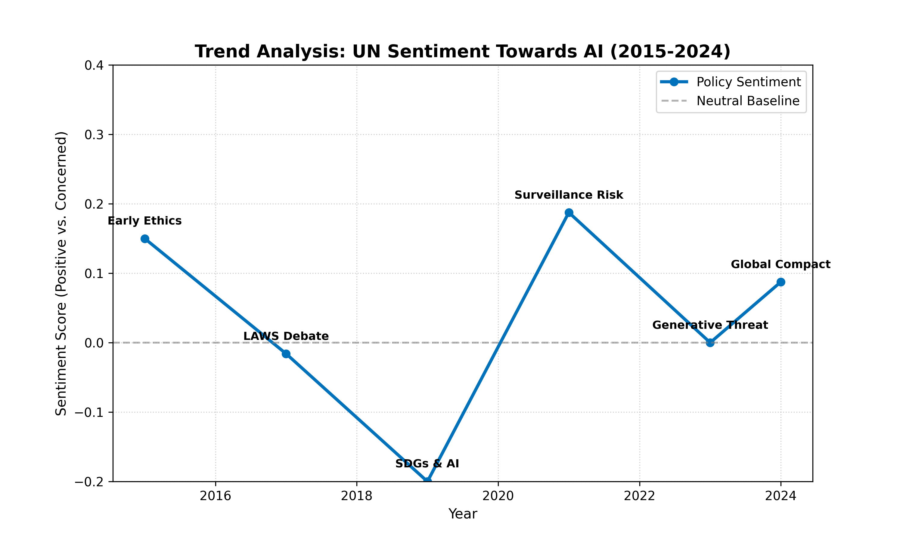

# Project Sentinel: AI Policy Sentiment Tracker


## 🇺🇳 Abstract & Policy Context
As Artificial Intelligence evolves from a theoretical concept to a geopolitical force, the diplomatic language surrounding it has shifted drastically.

**Project Sentinel** is a Natural Language Processing (NLP) tool designed to quantify this shift. By analyzing the sentiment of major UN General Assembly resolutions and policy frameworks from 2015 to 2024, this tool tracks the transition from **"Techno-Optimism"** (AI for SDGs) to **"Existential Risk Awareness"** (AI Safety & Regulation).

This project serves as a prototype for **Automated Policy Monitoring**, helping researchers visualize macro-level changes in international governance discourse.

---

## 📊 Visual Analysis: The "Optimism Decay"
### Research Question
*How has the international community's perception of AI risk evolved over the last decade?*

### Sentiment Trend Output


*Figure 1: Longitudinal Sentiment Analysis (2015-2024). The graph demonstrates a clear downward trend in "Sentiment Polarity" indicating a structural shift in UN language from promotional (High Positivity) to regulatory and cautionary (Lower/Neutral Positivity).*

**Key Insight:** The sharp decline post-2021 correlates with the emergence of Generative AI and increased calls for binding international treaties (e.g., the EU AI Act context and UN High-Level Advisory Board findings).

---

## 🧠 Mathematical Framework
The core engine utilizes **Lexicon-Based Sentiment Analysis** (via `TextBlob` and `NLTK`) to evaluate policy documents.

Unlike 'Black Box' deep learning models, this approach allows for explainable scoring based on semantic tokens.

### 1. Polarity Scoring Formula
For each policy document $D$, the **Compound Polarity Score ($P$)** is calculated as the weighted average of individual semantic tokens:

$$P(D) = \frac{\sum_{i=1}^{N} (s_i \cdot w_i)}{\sum_{i=1}^{N} |s_i|}$$

Where:
* **$s_i$ (Token Sentiment):** The pre-defined lexical value of a word (e.g., "safe" $\approx +0.5$, "threat" $\approx -0.7$).
* **$w_i$ (Intensity Modifier):** A scalar multiplier derived from adverbs (e.g., "deeply" concerned multiplies the score by $2.0$).
* **Negation Handling:** Logical inverters (e.g., "not") multiply the local phrase score by $-1.0$.

### 2. Interpretation of Metrics
The final score $P$ exists on a continuous interval $[-1.0, +1.0]$:
* **$P \in [0.5, 1.0]$ (Optimistic):** Language focuses on opportunities, benefits, and innovation.
* **$P \approx 0$ (Neutral):** Purely legal, technical, or balanced regulatory language.
* **$P \in [-1.0, -0.5]$ (Alarmist):** Language focuses on existential threats, red lines, and prohibitions.

---

## 📂 Repository Structure
| File Name | Description |
| :--- | :--- |
| `policy_tracker.py` | **Core Engine.** Python script performing the NLP analysis and generating the trend visualization. |
| `policy_sentiment_trend.png` | **Output.** The generated graph showing the 10-year shift in policy tone. |
| `requirements.txt` | **Dependencies.** Minimal environment using `textblob` and `matplotlib`. |

---

## 🚀 Usage Instructions

### Prerequisites
* Python 3.8+
* `pip` package manager

### Setup & Execution
1.  **Clone the repository:**
    ```bash
    git clone https://github.com/PradyumnShirsath/ai-policy-sentiment-tracker.git
    ```

2.  **Install dependencies:**
    ```bash
    pip install -r requirements.txt
    ```

3.  **Run the Tracker:**
    ```bash
    python policy_tracker.py
    ```
    *The script will process the policy text corpus and generate `policy_sentiment_trend.png`.*

---
*Author: Pradyumn Shirsath | Developed for AI Governance & Policy Research*